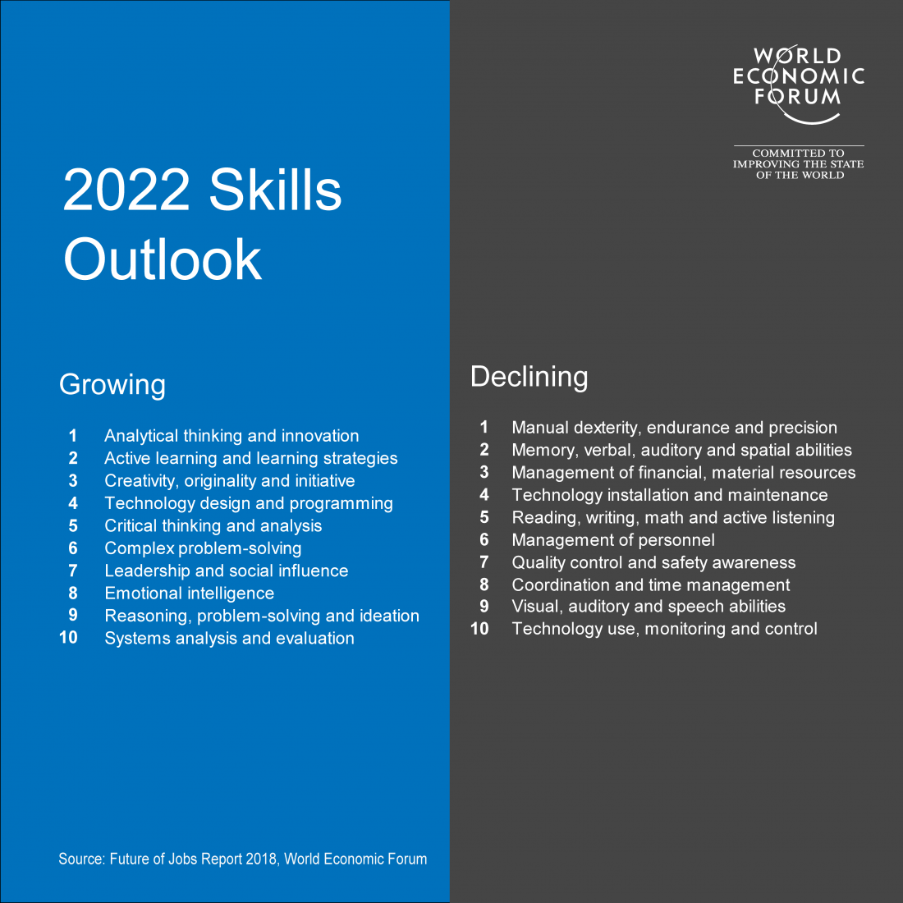
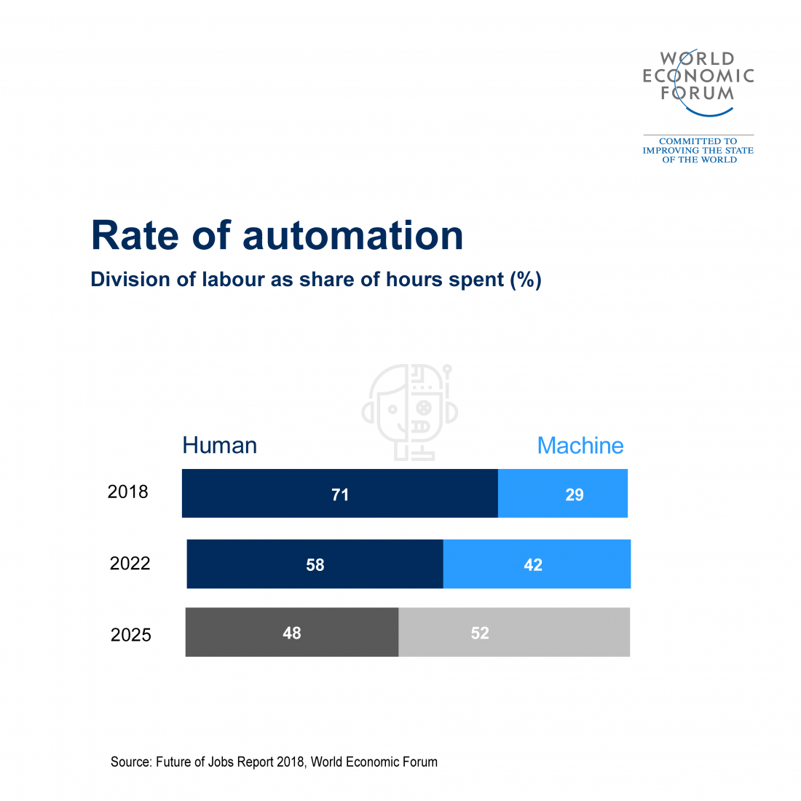

# Additional Materials

If you want to learn more about the future of the workforce, I would recommend you take a look at [The Future of Jobs Report](https://www.weforum.org/reports/the-future-of-jobs-report-2018), by the World Economic Forum, and [The rise of the social enterprise](https://www2.deloitte.com/content/dam/insights/us/articles/HCTrends2018/2018-HCtrends_Rise-of-the-social-enterprise.pdf) by Deloitte. 

Below are a couple of infographics from the World Economic Forum about the predicted rates of automation and growing/declining skills by 2022, that I found particularly compelling: 

Additional and recommended resources can be found in the [References](./references). 